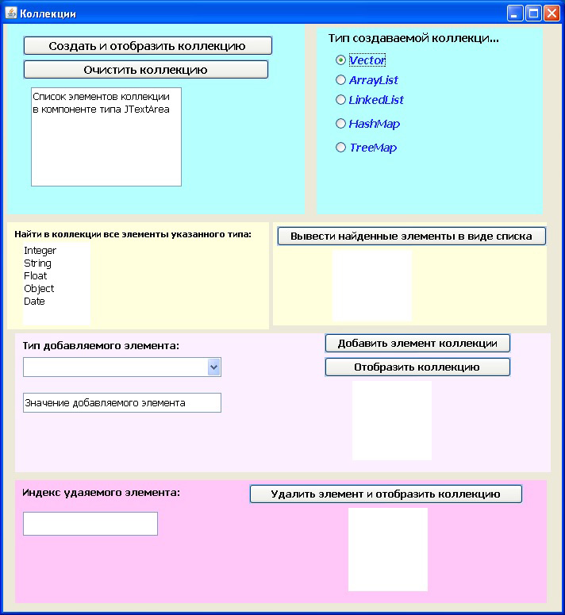

# Зачётное задание 1. Коллекции
Задание выполняется на языке Java с использованием классов JDK, для построения графического интерфейса применять компоненты пакета javax.swing.  

Создать графический интерфейс пользователя, позволяющий:  
* создавать новую коллекцию указанного типа;
* добавлять элементы в коллекцию;
* удалять элементы коллекции;
* находить элементы коллекции указанного типа;
* отображать коллекцию.  

В задании должен быть представлен код обработчиков событий, выполняющий действия, указанные кнопками. Эти действия должны учитывать тип коллекции, над которой они выполняются.  

Для отображения найденных элементов в виде списка использовать элемент управления - список.  

На рисунке представлен внешний вид создаваемого графического интерфейса.

Результат выполнения задания прислать в файле в формате Word (без архивирования, версия 2007 или ниже).  
В файл разместить:  
* скриншот выполнения вашего приложения,
* скриншот среды разработки с открытым проектом,
* весь код с комментариями (текст кода размещать непосредственно в файле, без ссылок).